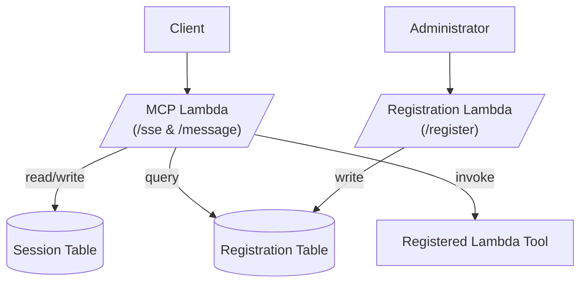

[](https://mseep.ai/app/markvp-mcp-lambda-sam)

# MCP Lambda SAM

Model Context Protocol (MCP) implementation using AWS Lambda and SAM.

## Overview

This project provides a serverless implementation of the Model Context Protocol, with two distinct interfaces:

1. **System Configuration** (Administrative):
   - Registration of MCP tools, resources, and prompts
   - IAM permission management
   - Infrastructure setup and configuration

2. **System Usage** (Client):
   - Establishing SSE connections
   - Sending commands
   - Receiving streaming responses

## Architecture

### Mermaid Diagram

You can visualize the system using this Mermaid syntax:



- The **MCP Lambda** reads registrations from the Registration Table on startup and when handling requests.
- It uses the Session Table to persist session state.
- It **invokes registered Lambda tools** dynamically using the ARNs stored in the Registration Table. 

## System Configuration Guide (Administrators)

This section is for system administrators who need to configure and manage the MCP server.

### Deployment

```bash
npx @markvp/mcp-lambda-sam deploy
```

The command will interactively prompt for administrative configuration:
- Stack name (for multiple instances)
- AWS Region
- VPC configuration (optional)

### Permissions Overview

To access MCP endpoints, users and clients must have IAM permission to invoke the relevant Function URLs.

- **Administrators**: must be allowed to invoke the `mcp-registration` function URL
- **Clients**: must be allowed to invoke the `mcp` function URL

You can grant access using either an IAM policy or `aws lambda add-permission` (see below).

### Assigning Permissions via AWS CLI

To grant permission to invoke the **registration function URL**:

```bash
aws lambda add-permission \
  --function-name <registration-function-name> \
  --statement-id allow-registration \
  --action lambda:InvokeFunctionUrl \
  --principal "*" \
  --function-url-auth-type IAM
```

To grant permission to invoke the **MCP function URL** (SSE and message):

```bash
aws lambda add-permission \
  --function-name <mcp-function-name> \
  --statement-id allow-mcp \
  --action lambda:InvokeFunctionUrl \
  --principal "*" \
  --function-url-auth-type IAM
```

Replace `<registration-function-name>` and `<mcp-function-name>` with the actual Lambda function names.

### Registration API

Use these endpoints to manage MCP tools, resources, and prompts:

#### Register a New Tool
```bash
awscurl -X POST ${REGISTRATION_URL}/register \
  --region ap-southeast-2 \
  --service lambda \
  -H "Content-Type: application/json" \
  -d '{
    "type": "tool",
    "name": "example",
    "description": "Example tool",
    "lambdaArn": "arn:aws:lambda:region:account:function:name",
    "parameters": {
      "input": "string"
    }
  }'
```

#### Update Registration
```bash
awscurl -X PUT ${REGISTRATION_URL}/register/{id} \
  --region ap-southeast-2 \
  --service lambda \
  -d '...'
```

#### Delete Registration
```bash
awscurl -X DELETE ${REGISTRATION_URL}/register/{id} \
  --region ap-southeast-2 \
  --service lambda
```

#### List Registrations
```bash
awscurl ${REGISTRATION_URL}/register \
  --region ap-southeast-2 \
  --service lambda
```

### Required IAM Permissions

#### For Administrators
Administrators need these permissions to manage registrations:
```json
{
  "Version": "2012-10-17",
  "Statement": [{
    "Effect": "Allow",
    "Action": "lambda:InvokeFunctionUrl",
    "Resource": "arn:aws:lambda:${region}:${account}:function:${stack-id}-mcp-registration",
    "Condition": {
      "StringEquals": {
        "lambda:FunctionUrlAuthType": "AWS_IAM"
      }
    }
  }]
}

```

## System Usage Guide (Clients)

This section is for clients who want to use the MCP server.

### Required IAM Permissions

Clients need these permissions to use the MCP server:
```json
{
    "Version": "2012-10-17",
    "Statement": [
        {
            "Effect": "Allow",
            "Action": "lambda:InvokeFunctionUrl",
            "Resource": [
                "arn:aws:lambda:${region}:${account}:function:${stack-id}-mcp",
            ],
            "Condition": {
                "StringEquals": {
                    "lambda:FunctionUrlAuthType": "AWS_IAM"
                }
            }
        }
    ]
}
```

### Connecting to the Server

1. **Establish SSE Connection**:
```typescript
const sse = new EventSource(SSE_URL, {
  headers: { 
    Authorization: 'AWS4-HMAC-SHA256 ...', // Must be AWS SigV4 signed
  }
});

sse.onmessage = (event) => {
  console.log(JSON.parse(event.data));
};
```

### Example cURL for SSE

```bash
awscurl -X GET "${MCP_URL}/sse" \
  --region ap-southeast-2 \
  --service lambda
```

The first event will include a `sessionId`. Use this when sending messages.

2. **Send Commands**:
```bash
awscurl -X POST "${MCP_URL}/message?sessionId=session-123" \
  --region ap-southeast-2 \
  --service lambda \
  -H "Content-Type: application/json" \
  -d '{
    "jsonrpc": "2.0",
    "id": "1",
    "method": "example",
    "params": {
      "input": "hello"
    }
  }'
```

### Error Handling

#### Common Client Errors
- `401`: Invalid/missing AWS credentials
- `403`: Insufficient permissions
- `404`: Invalid session ID
- `429`: Rate limit exceeded

#### Troubleshooting
1. **Connection Issues**:
   - Verify AWS credentials
   - Check IAM permissions
   - Ensure network connectivity

2. **Command Execution Errors**:
   - Verify session ID is active
   - Check command format matches tool registration
   - Ensure parameters match schema

## Requirements

- AWS CLI installed and configured
- AWS SAM CLI installed
- Node.js 20.x or later
- An AWS account with permissions to create:
  - Lambda functions
  - DynamoDB tables
  - IAM roles
  - SQS queues

## AWS SAM CLI Setup

To deploy this application locally or to AWS using the AWS SAM CLI:

1. Install the AWS SAM CLI: https://docs.aws.amazon.com/serverless-application-model/latest/developerguide/install-sam-cli.html
2. Ensure it's available in your PATH:
   ```bash
   sam --version
   ```
3. Build and deploy the application:
   ```bash
   sam build
   sam deploy --guided
   ```
4. Follow the prompts to configure the stack name, region, capabilities, and parameter overrides.

You can rerun `sam deploy` without `--guided` to use saved configuration.

## Installation

You can install and deploy this application in four ways:

### 1. Using AWS Serverless Application Repository (SAR)

The easiest way to deploy the MCP server is through the AWS Serverless Application Repository (SAR):

- Go to the [SAR Console](https://serverlessrepo.aws.amazon.com/applications)
- Search for **mcp-lambda-sam** by Mark Van Proctor
- Click **Deploy**
- Set your parameters:
  - `StackIdentifier`: Unique ID for this MCP server instance
  - `VpcEnabled`: Set to `true` if deploying in a VPC
  - `VpcId` and `SubnetIds`: Provide only if `VpcEnabled` is `true`
- Follow the prompts to deploy

Alternatively, you can deploy from the AWS CLI:
```bash
aws serverlessrepo create-cloud-formation-change-set \
  --application-id arn:aws:serverlessrepo:ap-southeast-2:522814717816:applications/mcp-lambda-sam \
  --stack-name your-stack-name \
  --capabilities CAPABILITY_IAM \
  --parameter-overrides '[{"name":"StackIdentifier","value":"your-stack-id"}]'
```
  
### 2. Using npx (CLI)

```bash
npx @markvp/mcp-lambda-sam deploy
```

The command will interactively prompt for administrative configuration:
- Stack name (for multiple instances)
- AWS Region
- VPC configuration (optional)

### 3. Programmatic Usage with Install
Install the package:

```bash
npm install @markvp/mcp-lambda-sam
```

After installing the package, you can use it programmatically:
```javascript
import { deploy } from '@markvp/mcp-lambda-sam';

// Usage example
deploy();
```

### 4. Local Development and Deployment
Install the package:

```bash
npm install @markvp/mcp-lambda-sam
```

After making development changes, you can deploy it manually:
```bash
npm run deploy
```

## Development
```bash
# Install dependencies
npm install

# Lint
npm run lint

# Run tests
npm test

# Build
npm run build

# Deploy
npm run deploy
```

### Publishing to SAR

If you're contributing to this project and need to publish updates to SAR:

1. Package the application:
```bash
npm run package:sar
```

2. Publish to SAR:
```bash
npm run publish:sar
```

3. Make the application public (one-time setup):
   - Go to AWS Console > Serverless Application Repository
   - Select the application
   - Click "Share" and choose "Public"
   - Apply the following sharing policy:
   ```json
   {
       "Version": "2012-10-17",
       "Statement": [
           {
               "Effect": "Allow",
               "Principal": "*",
               "Action": "serverlessrepo:CreateCloudFormationTemplate",
               "Resource": "arn:aws:serverlessrepo:${region}:${account-id}:applications/mcp-lambda-sam"
           }
       ]
   }
   ```

## License

MIT

## Contributing

1. Fork the repository
2. Create your feature branch
3. Commit your changes
4. Push to the branch
5. Create a new Pull Request
